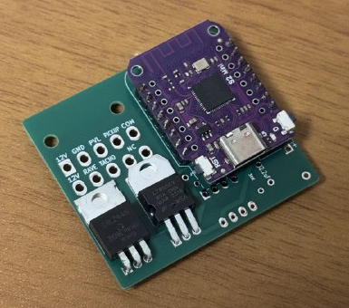
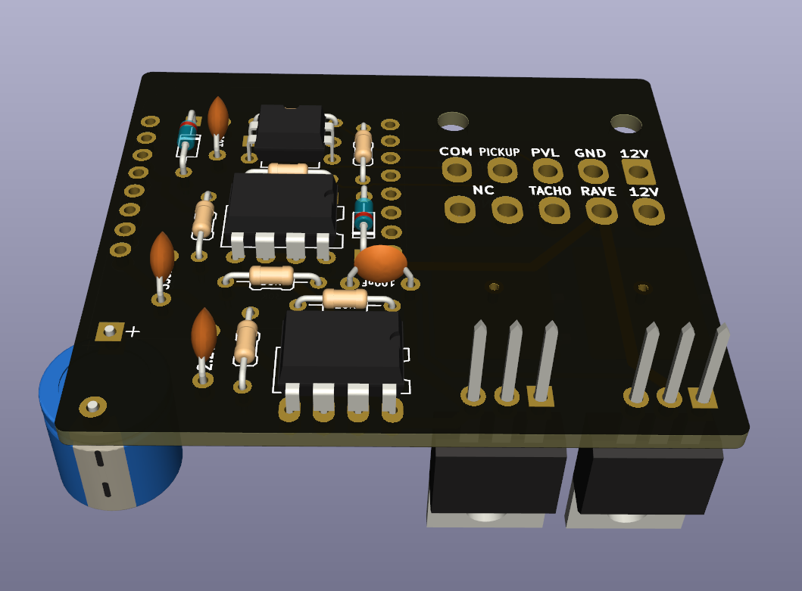

# EV-Controller

This project is an ESP8266/ESP32-based exhaust valve controller for motorcycles. It offers real-time monitoring and configuration through a web interface, utilizing WebSockets for live data communication. The core functionality is to control the motorcycle's exhaust valve based on configurable RPM thresholds.

<table>
  <tr>
    <td>
      <br>
      
    </td>
    <td>
      
    </td>
  </tr>
</table>

## Features

- RPM-based exhaust valve control with configurable opening and closing thresholds.
- Web interface for real-time RPM monitoring and settings adjustment.
- WiFi Access Point (AP) mode for initial setup and configuration.
- WiFi Station (STA) mode to connect to an existing wireless network.
- Secure Over-the-Air (OTA) updates for both firmware and filesystem.
- Manual override for valve control directly from the web interface.

## Hardware Construction

To build the hardware, you will need to manufacture the PCB and source the electronic components.

### 1. PCB Manufacturing

The Gerber files required for PCB production are located in the `pcb/production/gerber.zip` archive. You can upload this file to any PCB manufacturer of your choice.

### 2. Component Sourcing

The list of all necessary components (Bill of Materials) is available in the `pcb/production/bom.csv` file. This file can be used to order parts from electronic component distributors.

### 3. Assembly

Solder the components onto the manufactured PCB. For component placement and orientation, please refer to the following files:

- **Schematic:** `pcb/schema.pdf`
- **KiCad Project:** `pcb/Rave-Controller.kicad_pro` (can be opened with KiCad)

For automated pick-and-place assembly, the `pcb/production/positions.csv` file is also provided.

## Firmware Installation

The firmware is built using PlatformIO.

### Prerequisites

- [Visual Studio Code](https://code.visualstudio.com/)
- [PlatformIO IDE extension](https://platformio.org/install/ide?install=vscode) for VS Code

### Build and Upload

1.  Clone this repository to your local machine.
2.  Open the cloned repository folder in Visual Studio Code.
3.  PlatformIO will automatically detect the `platformio.ini` file and prompt you to install the required project dependencies.
4.  Once dependencies are installed, select the correct environment for your board (e.g., `d1_mini`).
5.  Use the PlatformIO "Upload" task to build and flash the firmware to your device. Alternatively, you can run the following command from the integrated terminal:
    ```bash
    pio run -e d1_mini --target upload
    ```

## Initial Setup

1.  On the first boot, the device will create a Wi-Fi Access Point. The default SSID and password can be found in the source code (`data/config.json`).
2.  Connect your computer or smartphone to this Wi-Fi network.
3.  Open a web browser and navigate to the device's default IP address, which is `42.42.42.42`.
4.  From the web interface, you can configure your home Wi-Fi credentials (SSID and password) and set the desired RPM thresholds for the exhaust valve operation.
5.  After saving the new settings, the device will restart, connect to your specified Wi-Fi network, and begin normal operation.
